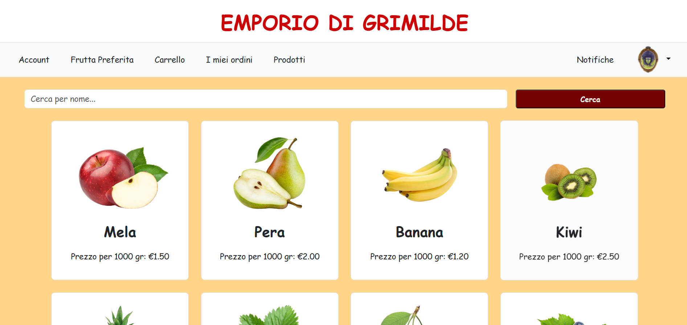
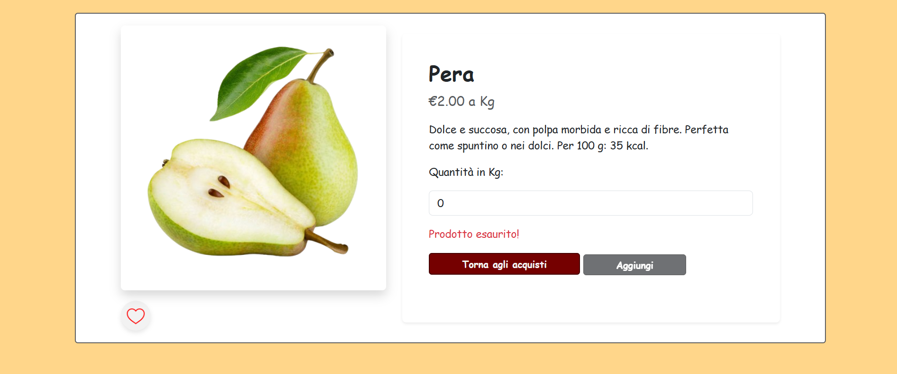
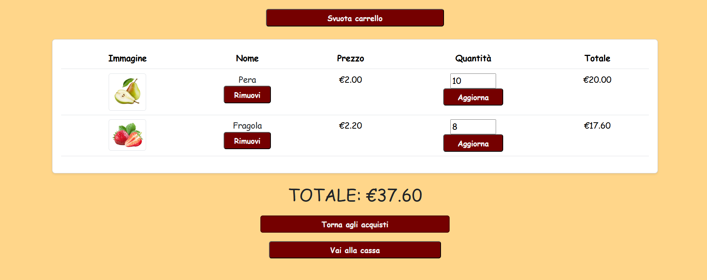
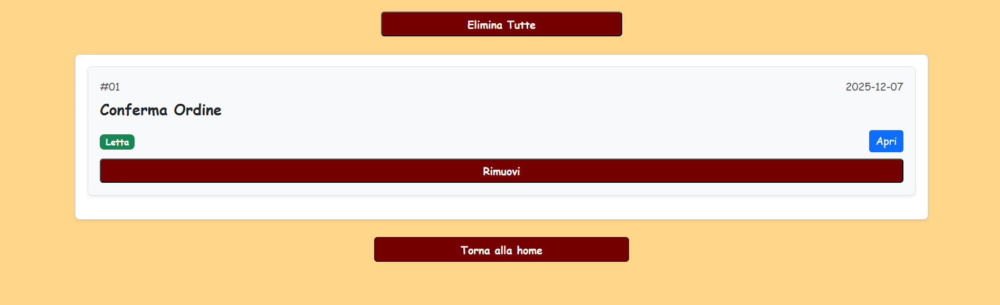

# EMPORIO DI GRIMILDE || E-COMMERCE

*Read this in [Italian](README.it.md).*

## 📌 Description
This project is a fruit e-commerce platform built with both user-facing and administrator architectures. Its goal is to provide an intuitive interface for browsing and purchasing products, along with a management system for store administration.

> **Note:** The application interface and content are currently in Italian.

## 🛠️ Tech Stack
Backend: PHP

Frontend: HTML, CSS, JavaScript, Bootstrap

Database: MySQL

## 🚀 Local Setup
- Clone the repository (Move the project folder inside your local server directory C:\xampp\htdocs).

- Start your local server environment (e.g., XAMPP, WAMP) and click the "Start" buttons next to **Apache** and **MySQL**.

- Open [phpMyAdmin](http://localhost/phpmyadmin/index.php?route=/) and click on the **SQL** tab. Copy and paste the content of `db/GrimildeDatabase.SQL` into the query area and execute it. Immediately after, do the same with `db/inserisci_dati.sql` (this will import and populate the database).

- Open your browser and navigate to the project URL: `http://localhost/EmporioGrimilde/php/`

## 🕹️ Running the Project Again
- Launch XAMPP and click "Start" next to **Apache** and **MySQL**.

- Open your browser and navigate to (http://localhost/EmporioGrimilde/php/)

## 🔎 Details
E-Mail and Password:
| E-MAIL | PASSWORD | ADMIN |
|--- |--- |--- |
| sofialotti17@gmail.com | ciao1234 | NO |
| sebastiano.lucarelli@gmail.com | ciao5678 | NO |
| paolorossi@gmail.com | admin | YES |

## Screenshots

  <b>Products</b> 
  

  <b>Product Details</b> 
  

  <b>Cart</b> 
  

  <b>Notifications</b> 
  

